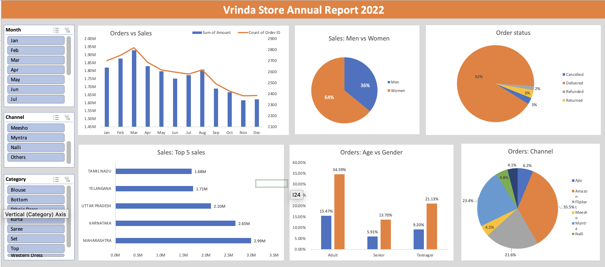

# Vrinda Store Sales Analysis (2022)

## Objective
Analyze sales data to understand customer behavior and improve sales strategy for 2023.

## Tools Used
- Excel (Pivot Tables, Dashboard)

## Key Insights
- Women contribute 64% of total sales
- March is the highest sales month
- Amazon is the top channel
- Maharashtra & Karnataka are top states
- Adults are the main customers

## Files
- Vrinda_Store_Dashboard.xlsx
- Vrinda_Report.pdf

- ## Dashboard Preview

